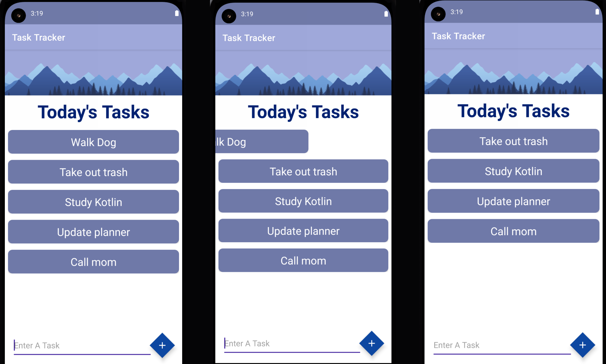

# CHECKED: A ToDo List App with Swipe to Delete


## Table of Contents
* [General Info](#general-info)
* [Technologies](#technologies)
* [Setup](#setup)

## General Info
This app let's users add a task to the interface, then swipe to delete once task is completed.
### Features
* RecyclerView
* ItemTouchHelper
* Material Design

## Technologies
* Android Studio
* Kotlin

## Setup
```
Download Android Studio
Download file and open in Android Studio
Run on emulator
```


